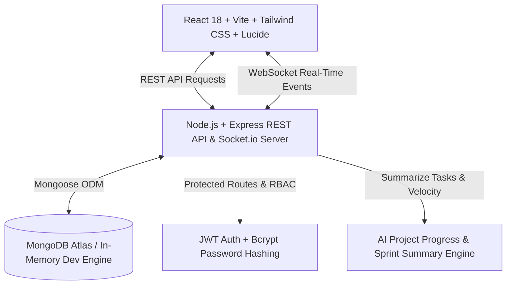

# 🚀 TeamFlow | Enterprise Team Task & Project Management System (MERN Stack)

<div align="center">


**A high-performance, real-time Team Task & Project Management web application (a mini Jira/Linear/Trello hybrid). Built using the full MERN stack, WebSockets, Role-Based Access Control (RBAC), and AI-powered project progress synthesis.**

[Features](#-key-features) • [Tech Stack](#-tech-stack) • [Live Demo Credentials](#-demo-credentials) • [Quick Start](#-quick-start-guide) • [API Documentation](#-rest-api-endpoints-overview)

</div>

---

## 🌟 Key Features & Capabilities

| Feature | Implementation | Architectural Value |
| :--- | :--- | :--- |
| **Authentication & RBAC** | JWT (7-day expiry), Bcrypt password hashing (10 salt rounds), Authorization middleware | Strict role enforcement across **Admin**, **Manager**, and **Member** |
| **Relational Data in MongoDB** | Mongoose schemas with ObjectId references (`User`, `Project`, `Task`, `Activity`) | Normalized schemas with compound indexing on `{ project: 1, status: 1 }` |
| **Interactive Kanban Board** | HTML5 Drag-and-Drop between `To Do`, `In Progress`, `In Review`, `Done` | Dynamic state updates with optimistic rendering and multi-filter support |
| **Real-time Live Sync** | Socket.io rooms (`project:${id}`) | Instant status changes, new tasks, and comment broadcasts without page refreshes |
| **Analytics Dashboard** | KPI metric cards, progress bars, overdue risk watchlist, and audit trail | Live aggregation of project velocity, WIP, and completion rates |
| **AI Sprint Summary** | Intelligent Progress Analyzer (Heuristics + Gemini/Claude API integration) | Health scoring (0–100%), velocity scoring, blocker detection, and actionable tips |
| **Zero-Friction Dev Mode** | Dual-Engine DB: Atlas URI support + automatic in-memory MongoDB fallback | Runs immediately out of the box with `npm run dev` with zero setup hurdles! |

---

## 📸 Demo Credentials

The login screen features **1-Click Quick Demo Login** buttons for instant role switching:

| Role | Email | Password | Permissions |
| :--- | :--- | :--- | :--- |
| 👑 **Admin** | `admin@teamflow.io` | `Admin@123` | Full control: create/delete projects, manage members, assign roles, view all metrics |
| 💼 **Manager** | `manager@teamflow.io` | `Manager@123` | Create/edit projects and tasks, assign team members, run AI summaries |
| 👤 **Member** | `member@teamflow.io` | `Member@123` | View assigned projects, update task statuses (drag & drop), add comments |

---

## 🏗️ Architecture & Data Flow



---

## 🛠️ Tech Stack

- **Frontend**: React 18, Vite, React Router v6, Axios, Lucide React, Tailwind CSS, Modern Dark-Mode Glassmorphism Design System
- **Backend**: Node.js, Express.js, Socket.io, Mongoose ODM, JSONWebToken, Bcryptjs, CORS, Dotenv
- **Database**: MongoDB (Atlas connection string or auto-booting in-memory engine)
- **Real-Time**: WebSockets via Socket.io
- **AI Summary**: Adaptive Project Health & Risk Analysis Engine

---

## 🚀 Quick Start Guide

### 1. Prerequisites
- **Node.js** v18+ (tested on Node v22)
- **npm** v9+

### 2. Clone the Repository
```bash
git clone https://github.com/anshi102004/teamflow-mern.git
cd teamflow-mern
```

### 3. Backend Setup
```bash
cd server
npm install
npm run dev
# Server boots on http://localhost:5000 with real-time WebSocket listening!
```

### 4. Frontend Setup
In a new terminal window:
```bash
cd client
npm install
npm run dev
# Client runs on http://localhost:5173
```

Open **http://localhost:5173** and click any of the **1-Click Quick Demo Login** buttons!

---

## 📡 REST API Endpoints Overview

### Authentication (`/api/auth`)
- `POST /api/auth/register` - Create new user account with role
- `POST /api/auth/login` - Authenticate user & return signed JWT
- `GET /api/auth/me` - Get logged-in user profile (Protected)
- `GET /api/auth/users` - Get all team members for task assignment (Protected)

### Projects (`/api/projects`)
- `GET /api/projects` - Get all accessible projects with task metrics (Protected)
- `POST /api/projects` - Create new project (Admin / Manager)
- `GET /api/projects/:id` - Get project details by ID (Protected)
- `PUT /api/projects/:id` - Update project details (Admin / Manager)
- `DELETE /api/projects/:id` - Delete project and all associated tasks (Admin)
- `POST /api/projects/:id/ai-summary` - Generate AI sprint velocity & health summary (Protected)
- `GET /api/projects/:id/activities` - Fetch audit log stream (Protected)

### Tasks (`/api/tasks`)
- `GET /api/projects/:projectId/tasks` - Filtered & searched tasks (Protected)
- `POST /api/projects/:projectId/tasks` - Create task (Admin / Manager)
- `GET /api/tasks/:id` - Get single task with comments (Protected)
- `PUT /api/tasks/:id` - Edit task details (Protected, RBAC enforced)
- `PATCH /api/tasks/:id/status` - Drag-and-drop status update (Protected)
- `DELETE /api/tasks/:id` - Remove task (Admin / Manager)
- `POST /api/tasks/:id/comments` - Add comment to task (Protected)

---

## 📁 Repository Structure

```
teamflow-mern/
├── server/
│   ├── config/db.js               # MongoDB connection (Atlas + auto in-memory)
│   ├── controllers/
│   │   ├── authController.js      # Auth, JWT, user retrieval
│   │   ├── projectController.js   # Projects CRUD + metrics aggregation
│   │   ├── taskController.js      # Tasks CRUD, status updates, comments
│   │   └── aiController.js        # AI Sprint velocity & risk engine
│   ├── middleware/
│   │   ├── authMiddleware.js      # JWT verify & RBAC gatekeeper
│   │   └── errorMiddleware.js     # Centralized error handler
│   ├── models/
│   │   ├── User.js                # User schema + bcrypt salt hash
│   │   ├── Project.js             # Project schema with members
│   │   ├── Task.js                # Task schema with priority, tags & comments
│   │   └── Activity.js            # Audit log schema
│   ├── routes/                    # Express route declarations
│   ├── seed/seedData.js           # Auto-populates demo accounts and sprint tasks
│   ├── socket/socketHandler.js    # Socket.io room broadcasts
│   └── server.js                  # Entry point
├── client/
│   ├── src/
│   │   ├── components/
│   │   │   ├── auth/              # Login with 1-click role switcher, Register
│   │   │   ├── common/            # Navbar, Sidebar with project switcher
│   │   │   ├── kanban/            # Drag & drop board, column, task cards
│   │   │   ├── dashboard/         # KPI metrics, status charts, audit feed
│   │   │   ├── tasks/             # Task details, comments, task creator
│   │   │   ├── projects/          # Projects portfolio & creation
│   │   │   └── ai/                # AI Sprint Summary modal
│   │   ├── context/               # AuthContext & SocketContext
│   │   ├── services/api.js        # Axios instance with JWT interceptor
│   │   ├── App.jsx
│   │   └── index.css              # Tailwind + Custom dark glassmorphism CSS
│   ├── tailwind.config.js
│   ├── postcss.config.js
│   └── index.html
├── package.json                   # Root monorepo scripts
├── .gitignore                     # Production-ready git ignore
└── README.md
```

---

## 📄 License
This project is open source and available under the [MIT License](LICENSE).
